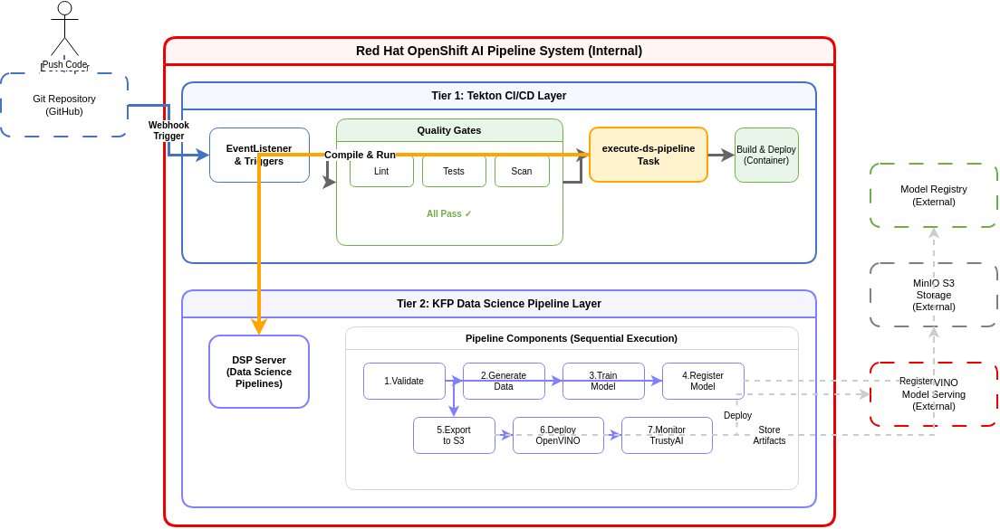
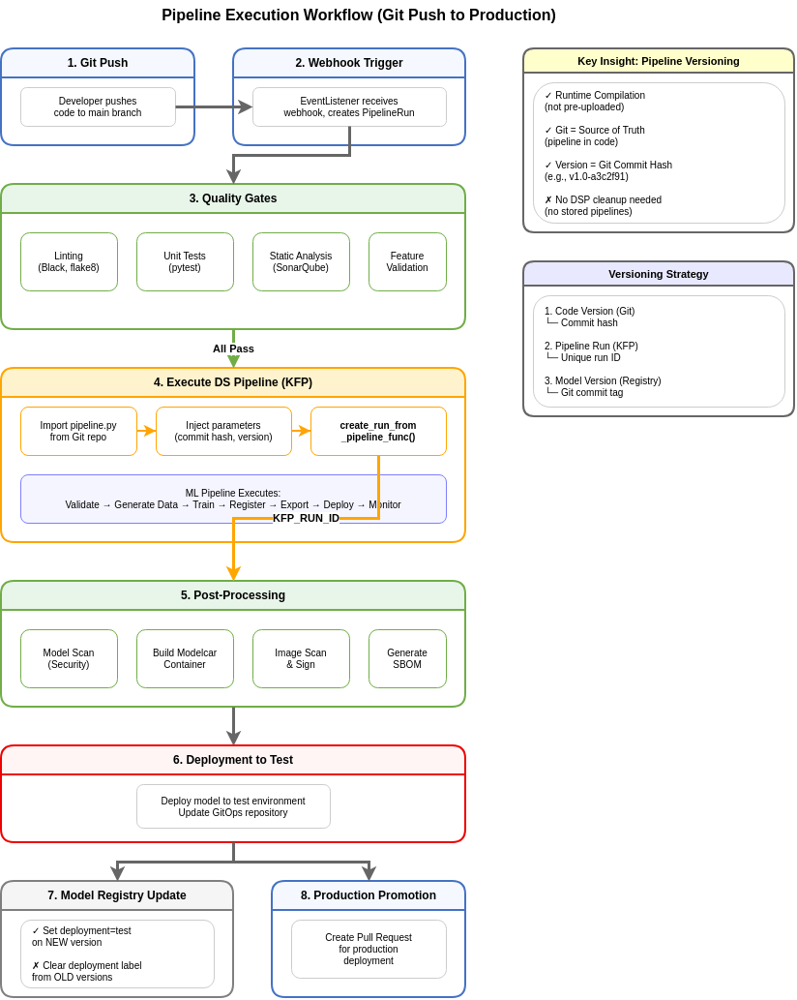

# RHOAI Pipelines Experimentation

Demonstration of OpenShift AI Data Science Pipelines capabilities through a complete fraud detection ML workflow: synthetic data generation, model training, model registry integration, KServe deployment, and performance benchmarking.

## Overview

This repository showcases:

- **Kubeflow Pipelines** - End-to-end ML workflow with 5 components
- **Tekton Automation** - CI/CD for pipeline deployment using OpenShift Pipelines
- **Model Registry** - Version tracking and metadata management
- **KServe Integration** - Model serving with InferenceService
- **Helm Deployment** - Declarative infrastructure as code
- **Red Hat Official Images** - Uses UBI9 and OpenShift Pipelines certified images

## Prerequisites

- OpenShift cluster with **Red Hat OpenShift AI 3.3.x** installed
- Namespace configured with:
  - DataSciencePipelines server running (KFP 2.5.0)
  - Model Registry server accessible
- **OpenShift Pipelines** operator installed (v1.15 or later)
- S3-compatible storage (MinIO or AWS S3)
- `oc` and `helm` CLI tools
- **Custom builder image** (see [Building the Image](#building-the-custom-image))

**Tested on:**
- OpenShift 4.20
- Red Hat OpenShift AI 3.3.0 / 3.3.2
- OpenShift Pipelines 1.15 - 1.22

## Container Images

This demo uses **official Red Hat container images**:

- **Kubeflow Pipeline Components**: `registry.access.redhat.com/ubi9/python-311` (UBI 9)
- **Tekton Tasks**: Uses Red Hat provided tasks from `openshift-pipelines` namespace via cluster resolver
  - `git-clone` - Official Red Hat task for Git repository cloning
- **Custom Builder**: Based on `registry.access.redhat.com/ubi9/python-311`

All images are:
- ✅ Certified and supported by Red Hat
- ✅ OpenShift-compatible (arbitrary user IDs)
- ✅ Security-scanned and updated regularly
- ✅ RHEL/UBI9-based for enterprise support

### Red Hat Provided Tasks

This demo exclusively uses Red Hat provided tasks from the `openshift-pipelines` namespace, referenced via the cluster resolver. This ensures:
- Tasks are maintained by Red Hat
- Automatic updates with OpenShift Pipelines operator
- No custom task definitions needed
- Consistent behavior across OpenShift clusters

## Quick Start

### 1. Build the Custom Image

Build and push the container image with pre-installed dependencies:

```bash
# Login to registry
podman login quay.io

# Build and push
cd container-image-tekton
IMAGE_NAME=quay.io/alopezme/rhoai-kfp-builder \
IMAGE_TAG=latest \
PUSH=true \
./build-image.sh
```

See [container-image-tekton/README.md](container-image-tekton/README.md) for details.

### 2. Install the Helm Chart

```bash
helm install fraud-detection chart/ \
  --set tekton.image=quay.io/alopezme/rhoai-kfp-builder:latest \
  --set s3.accessKeyId=<your-access-key> \
  --set s3.secretAccessKey=<your-secret-key> \
  --set s3.endpoint=<minio-endpoint> \
  --set namespace=<your-namespace>
```

This deploys:
- Tekton tasks and pipeline definitions
- PersistentVolumeClaim for workspace
- Secrets for S3 credentials
- ConfigMap with Kubeflow pipeline source code

### 3. Trigger the Tekton Pipeline

**Option A: Manual Trigger**

```bash
oc create -f tekton/example-run.yaml
```

**Option B: Webhook Trigger (Automated)**

Configure GitHub webhook to automatically trigger on push:

1. Get webhook URL:
```bash
oc get route kfp-webhook-listener -n <namespace> -o jsonpath='{.spec.host}'
```

2. Add webhook in GitHub repository settings:
   - **Payload URL**: `https://<route-host>`
   - **Secret**: Value from `tekton.triggers.webhookSecret`
   - **Events**: Push events

See [Tekton Triggers Setup](docs/notes/tekton-triggers-setup.md) for details.

### 4. Monitor Progress

```bash
# Watch Tekton pipeline
oc logs -f -n <your-namespace> -l tekton.dev/pipelineRun=fraud-detection-run

# Check Kubeflow pipeline in RHOAI UI
# Navigate to Data Science Pipelines → Runs
```

## Architecture

### High-Level Overview



**2-Tier Architecture:**

- **Tier 1: Tekton CI/CD Layer** - Orchestrates code quality, testing, and deployment
- **Tier 2: KFP Data Science Pipeline Layer** - Executes ML training and model deployment

### Pipeline Lifecycle & Versioning

This implementation follows the **runtime compilation pattern** used in production RHOAI environments:

#### Key Design Decisions

✅ **Runtime Compilation** - Pipelines are compiled from source code on-demand, not pre-uploaded to DSP  
✅ **Git as Source of Truth** - Pipeline definitions live in Git, ensuring version control and traceability  
✅ **Commit-Based Versioning** - Each run is tagged with Git commit hash (e.g., `v1.0-a3c2f91`)  
✅ **No Pipeline Cleanup Needed** - DSP doesn't store pipeline definitions, only run history  

#### Execution Workflow



**Complete workflow from Git push to production:**

1. **Git Push** → Developer pushes code to main branch
2. **Webhook Trigger** → EventListener receives webhook, creates PipelineRun
3. **Quality Gates** → Linting, unit tests, static analysis, feature validation (parallel)
4. **Execute DS Pipeline** → Imports `pipeline.py`, injects Git commit hash, calls `create_run_from_pipeline_func()`
5. **Post-Processing** → Model scanning, container build, image signing, SBOM generation
6. **Deployment** → Deploy to test environment, update GitOps repository
7. **Model Registry Update** → Mark new version as `deployed=test`, clear label from old versions
8. **Production PR** → Automated pull request for production deployment approval

#### Versioning Strategy

**Three levels of versioning:**

1. **Code Version** (Git) - Git commit hash tracks source code changes
2. **Pipeline Run Version** (KFP) - Each execution gets unique run ID in DSP
3. **Model Version** (Model Registry) - Tagged with commit hash, only latest marked as deployed

**Managing Old Versions:**

- **Pipeline definitions**: Not stored in DSP, no cleanup needed
- **Pipeline runs**: Naturally expire based on DSP retention policies
- **Model versions**: Only current version has `deployment_environment` label, old versions kept for history

See [docs/architecture.md](docs/architecture.md) for detailed component interactions.

## Repository Structure

```
.
├── chart/                      # Helm chart for deployment
│   ├── templates/              # Kubernetes/Tekton resources
│   └── values.yaml             # Configuration
├── pipelines/
│   └── fraud-detection/        # Kubeflow pipeline
│       ├── pipeline.py         # Pipeline definition
│       └── components/         # Pipeline components
├── tekton/                     # Tekton examples
├── docs/                       # Documentation
│   ├── architecture.md
│   ├── kubeflow-pipelines-primer.md
│   └── notes/                  # Architectural decisions
└── README.md
```

## How It Works

### Kubeflow Pipeline

The fraud detection pipeline demonstrates a complete ML workflow with 7 real components (no mocks):

1. **Validate Pipeline** - Verifies S3 and Model Registry connectivity before execution
2. **Generate Synthetic Data** - Creates 10,000 transaction records with realistic fraud patterns (~2% fraud rate)
3. **Train Model** - Trains a RandomForestClassifier with class balancing and logs metrics
4. **Register in Model Registry** - Stores model in RHOAI Model Registry via REST API
5. **Export to ONNX & Upload to S3** - Converts sklearn model to ONNX format and uploads to S3/MinIO
6. **Deploy with OpenVINO** - Creates KServe InferenceService with OpenVINO runtime (CPU-optimized)
7. **Configure TrustyAI** - Sets up bias detection and fairness monitoring (SPD, DIR metrics)

See [pipelines/fraud-detection/README.md](pipelines/fraud-detection/README.md) for component details.

### Tekton Automation

The Tekton pipeline automates deployment with optimized tasks:

1. **Git Clone** - Clones repository using Red Hat provided task from `openshift-pipelines` namespace
2. **Lint** - Validates code with Black, flake8, and pylint (pre-installed)
3. **Execute Pipeline** - Compiles, uploads, and runs DSP pipeline (waits for completion)

The pipeline orchestrates the 7-step ML workflow, deploying the model to OpenVINO and configuring TrustyAI monitoring automatically.

**Key optimizations for disconnected environments:**
- Uses custom builder image with all dependencies pre-installed
- No pip installs during execution (fast startup)
- Native Kubernetes authentication (ServiceAccount tokens)
- Single consolidated task for pipeline execution

See [tekton/README.md](tekton/README.md) for usage.

## Customization

### Modify Pipeline Parameters

Edit `chart/values.yaml`:

```yaml
kfpPipeline:
  name: my-custom-pipeline
  # ... other settings
```

Or override during install:

```bash
helm install fraud-detection chart/ \
  --set kfpPipeline.name=my-pipeline
```

### Change Model Algorithm

Edit `pipelines/fraud-detection/components/train_model.py`:

```python
from sklearn.linear_model import LogisticRegression

clf = LogisticRegression()
```

### Add Pipeline Components

1. Create a new component in `pipelines/fraud-detection/components/`
2. Import and use in `pipeline.py`
3. Update Helm chart if new dependencies are needed

## Related Repositories

- [rhoai-gitops](https://github.com/alvarolop/rhoai-gitops) - RHOAI installation and GitOps automation
- [rhoai-serving](https://github.com/alvarolop/rhoai-serving) - Model serving with KServe

## Learning Resources

- [Kubeflow Pipelines Primer](docs/kubeflow-pipelines-primer.md) - Introduction to KFP concepts
- [Architecture Details](docs/architecture.md) - Deep dive into the system design
- [Using Red Hat Tasks](docs/notes/using-red-hat-tasks.md) - Red Hat provided tasks via cluster resolver

## Troubleshooting

### Tekton Pipeline Fails

```bash
# List pipeline runs
oc get pipelinerun -n <namespace>

# Check logs
oc logs -n <namespace> -l tekton.dev/pipelineRun=<pipelinerun-name> --all-containers

# Common issues:
# - Syntax errors in pipeline.py → check lint output
# - Missing dependencies → verify requirements.txt
# - DSP API unreachable → check dsp.apiUrl in values.yaml
```

### Kubeflow Pipeline Fails

```bash
# View in RHOAI UI or check pod logs
oc logs -n <namespace> <pod-name>

# Common issues:
# - S3 credentials incorrect → verify secrets
# - Model Registry unavailable → check modelRegistry.url
# - Resource limits → adjust in component definitions
```

## License

GPL-3.0
